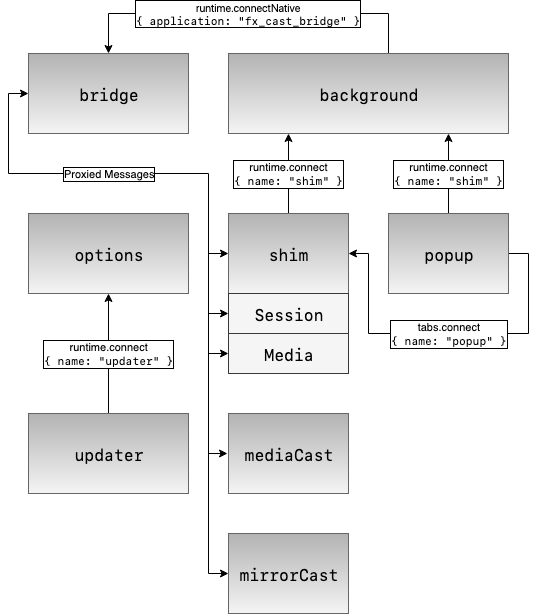

# Extension Lifetime

A bridge application instance (`statusBridge`) is created to keep track of receivers’ statuses. This is expected to exist throughout the lifetime of the extension and will automatically reconnect if unexpectedly disconnected.

The `shim/contentSetup.ts` content script is registered for all pages. It creates an empty `window.chrome` object in the page context since some sites may expect it to exist. It also intercepts any `src` attribute changes on `<script>` elements where the cast API may be loaded directly from a `chrome-extension://` URL, then sets them to the regular cast API script URL.

## Shim Initialization

The background script registers a `webRequest.onBeforeRequest` listener that intercepts requests to Google’s Cast API library.

When a request is intercepted, the `shim/content.ts` script is executed in the content script context. This facilitates any message passing across content/page script isolation (the shim itself is executed in the page context, both for convenience — since it interacts substantially with page scripts — and security reasons).

Messages passed to the shim are custom events of type `__castMessage`. Messages passed back from the shim are custom events of type `__castMessageResponse`. Event listening and creation is handled by the `shim/messageBridge.ts` module.

The `shim/content.ts` script creates a message port connection (named `shim`) to the background script through which messages from the shim are forwarded. Messages are forwarded to the bridge and other parts of the extension via the background script.  
The connection triggers the background script to spawn a bridge application instance. The tab/frame ID is stored and used identify shim instances.

The request is then redirected to the shim bundle (`shim/index.ts`) which creates the `window.chrome.cast` API object.

The `shim:/initialized` message is sent to the shim and the `window.__onGCastApiAvailable` callback is called with the availability state (bridge availability/compatibility is passed as the message data).

The cast API is now available to the web app.

The web app calls `chrome.cast.initialize` with an `ApiConfig` object containing the Chromecast receiver app ID to use. The shim sends a `main:/shimInitialized` message to the background script. The bridge sends `shim:/serviceUp` messages for any discovered devices with device info (address, port, label, etc…).

## User Interaction

A user will trigger casting through the web app interface and the app calls `chrome.cast.requestSession`. The shim sends a `main:/selectReceiverBegin` message to the background script to open the receiver selector.

The receiver selector is opened (popup browser window or native window depending on the receiver type). The receiver selector will handle user input and emit a `selected`, `cancelled`, or `error` event. Depending on the event, the background script will send a `shim:/selectReceiverEnd`, `shim:/selectReceiverCancelled` message to the shim. The `shim:/selectReceiverEnd` message contains info about the selected receiver and media type (`ReceiverSelection`).

The shim then makes a connection to the selected receiver device and establishes the session.

## Shim Implementation

Cast SDK API calls are translated into Chromecast protocol messages and sent via `node-castv2`. Based on [@GPMDP/electron-chromecast](https://github.com/GPMDP/electron-chromecast), so there are many similarities. The shim and the bridge exchange messages to implement API methods which require communication with the receiver device.

`Session` and `Media` objects have a counterpart object within the bridge. Some messages are routed directly to these objects. For `Session`, these are in the format `bridge:/session/impl_<methodName>`. For `Media`, it's `bridge:/media/impl_<methodName>`.

# Messages (WIP)

| No. | Subject                                       | Origin     | Destination | Description |
| --: | --------------------------------------------- | ---------- | ----------- | ----------- |
|  1  | `shim:/initialized`                           | background | shim        | Sent once bridge has been created. |
|  2  | `bridge:/initialize`                          | shim       | bridge      | Starts network discovery. |
|  3  | `shim:/serviceUp`                             | bridge     | shim        | Sent once a receiver device has been found. |
|  4  | `shim:/serviceDown`                           | bridge     | shim        | Sent once a receiver device has been lost. |
|  5  | `main:/openPopup`                             | shim       | background  | Opens the receiver selection popup. |
|  6  | `popup:/assignShim`                           | background | popup       | Provides popup with tab/frame ID for the opener shim so that it can make a direct connection. |
|  7  | `shim:/popupReady`                            | popup      | shim        | Sent once popup is ready to receive data. |
|  8  | `popup:/populateReceiverList`                 | shim       | popup       | Provides popup with current `state.receiverList`. |
|  9  | `shim:/selectReceiver`                        | popup      | shim        | Sent once a receiver has been selected. |
| 10  | `popup:/close`                                | shim       | popup       | Closes popup. |
| 11  | `bridge:/session/initialize`                  | shim       | bridge      | Initializes cast session with receiver device. |
| 12  | `bridge:/session/close`                       | shim       | bridge      | Closes cast session. |
| 13  | `shim:/session/connected`                     | bridge     | shim        | Sent once cast session has connected. |
| 14  | `shim:/session/updateStatus`                  | bridge     | shim        | Provides shim session with status updates. |
| 15  | `bridge:/session/impl_addMessageListener`     | shim       | bridge      | Sends data to bridge for implementation of `Session#addMessageListener` method. |
| 16  | `bridge:/session/impl_sendMessage`            | shim       | bridge      | Sends data to bridge for implementation of `Session#sendMessage` method. |
| 17  | `bridge:/session/impl_setReceiverMuted`       | shim       | bridge      | Sends data to bridge for implementation of `Session#setReceiverMuted` method. |
| 18  | `bridge:/session/impl_setReceiverVolumeLevel` | shim       | bridge      | Sends data to bridge for implementation of `Session#setReceiverVolumeLevel` method. |
| 19  | `bridge:/session/impl_stop`                   | shim       | bridge      | Sends data to bridge for implementation of `Session#stop` method. |
| 20  | `bridge:/media/initialize`                    | shim       | bridge      | Initializes bridge media message handler. |
| 21  | `bridge:/media/sendMediaMessage`              | shim       | bridge      | Sends media message to receiver device. |
| 22  | `shim:/session/impl_addMessageListener`       | shim       | popup       | Response from bridge->shim counterpart message. |
| 23  | `shim:/session/impl_sendMessage`              | shim       | popup       | Response from bridge->shim counterpart message. |
| 24  | `shim:/session/impl_setReceiverMuted`         | shim       | popup       | Response from bridge->shim counterpart message. |
| 25  | `shim:/session/impl_setReceiverVolumeLevel`   | shim       | popup       | Response from bridge->shim counterpart message. |
| 26  | `shim:/session/impl_stop`                     | shim       | popup       | Response from bridge->shim counterpart message. |
| 27  | `shim:/media/sendMediaMessageResponse`        | shim       | popup       | Response from `sendMediaMessage`. Contains error status. |
| 28  | `shim:/media/update`                          | shim       | popup       | Provides shim media with status updates. |
| 29  | `bridge:/startHttpServer`                     | mediaCast  | bridge      | Starts HTTP server for serving local media to receiver device. |
| 30  | `bridge:/stopHttpServer`                      | mediaCast  | bridge      | Stops HTTP server. |
| 31  | `mediaCast:/httpServerStarted`                | bridge     | mediaCast   | Sent once HTTP server has started. |
| 32  | `updater:/updateData`                         | options    | updater     | Sends initialization data to updater popup. |

