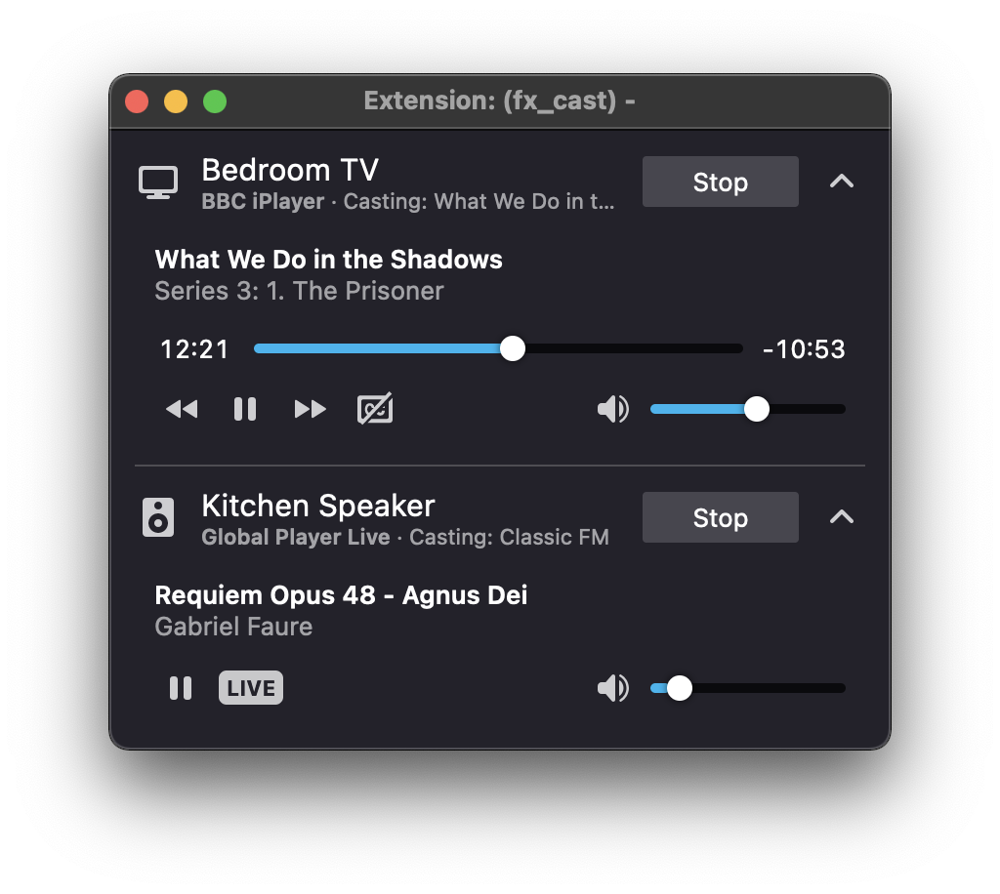

# fx_cast

A Firefox extension that implements the Chromecast API and exposes it to web apps to enable cast support. Communication with receiver devices is handled by a companion application (bridge).

## Installing

Install the Firefox extension (from within Firefox) and bridge application via the installer packages. These are two separate downloads that can be found on the [website](https://hensm.github.io/fx_cast/) or in the [GitHub releases](https://github.com/hensm/fx_cast/releases) section.

The bridge application is currently supported on Windows, macOS and Linux.

**Important**: On Linux platforms such as Arch, it may be necessary to [configure local hostname resolution](https://wiki.archlinux.org/index.php/avahi#Hostname_resolution)[^arch].

### Installing via package managers

**Note**: These packages are maintained by third parties and any issues specfic to these packages should be directed to the respective package maintainers.

-   **macOS (Homebrew cask)**
    -   `fx-cast-bridge` — https://formulae.brew.sh/cask/fx-cast-bridge  
        Install by running `brew install --cask fx-cast-bridge`.
-   **Arch Linux (AUR)**
    -   `fx_cast-bin` — https://aur.archlinux.org/packages/fx_cast-bin

### Daemon Configuration

See documentation on the [daemon wiki page](https://github.com/hensm/fx_cast/wiki/daemon).

## Usage

Clicking on the toolbar button or `Cast...` menu item in the page context menu will open a popup that shows a list of receiver devices will allow you to start casting the currently detected app[^cast_app] or media.

### Site Whitelist

The extension provides a whitelist for ensuring only trusted sites are allowed to load the cast API and communicate with receiver devices.

Sites may be added to the whitelist, either by clicking one of the whitelist options in the toolbar button context menu whilst visiting the site, or by manually entering a valid [match pattern](https://developer.mozilla.org/en-US/docs/Mozilla/Add-ons/WebExtensions/Match_patterns) on the options page.

Whitelisted sites should then display a cast button as in Chrome, provided they're compatible with the extension/Firefox.

## Building

### Requirements

-   Node.js v16.x.x
-   Native build tools (see [here](https://github.com/nodejs/node-gyp#installation))
-   Bonjour/Avahi (on Windows/Linux respectively)

### Installing dependencies

#### Windows:

-   [Bonjour SDK for Windows](https://developer.apple.com/download/more/?=Bonjour%20SDK%20for%20Windows)
-   [NSIS](https://nsis.sourceforge.io/Download)

#### Debian / Ubuntu:

```sh
$ sudo apt install libavahi-compat-libdnssd-dev dpkg rpm
```

Runtime packages: `avahi-daemon`.

#### Fedora:

```sh
$ sudo dnf install avahi-compat-libdns_sd-devel dpkg rpm-build
```

Runtime packages: `avahi`, `nss-mdns`.

#### Arch Linux:

```sh
$ sudo pacman -S avahi dpkg rpm-tools
```

### Instructions

```sh
$ git clone https://github.com/hensm/fx_cast.git
$ cd fx_cast
$ npm install
$ npm run build

# Install manifest for dist/ build. Installs to
# user-specific location and overrides a system-wide
# install. Call `remove-manifest` to restore previous state.
$ npm run install-manifest
$ npm run remove-manifest
```

This will build the ext and app, outputting to `dist/`:

-   `dist/app/`  
     ... contains the built bridge with launcher script and manifest (with the path pointing that script). The `install-manifest` npm script copies this manifest to the proper location (or adds its current location to the registry on Windows).
-   `dist/ext/`  
     ... contains the unpacked extension.

Watching ext changes:

```sh
$ npm run watch:ext
```

Launch Firefox with built extension (run in separate terminal):

```sh
$ npm run start:ext
```

#### 32-bit on Windows

Building a 32-bit version is only supported for Windows. If you're building from a 64-bit system, you'll also need to rebuild any native dependencies as 32-bit.

```sh
$ npm clean-install --prefix ./app --arch=ia32  # If on a 64-bit system

# If building without packaging
$ npm run build:app -- -- --arch=x86 --use-pkg

# If packaging
$ npm run package:app -- -- --arch=x86
```

### Build scripts

Extension build script (`build:ext`) arguments:

-   `--watch`  
     Rebuild on changes. Incompatible with `--package`.
-   `--package`  
     Package with web-ext.
-   `--mode` `"development"`, `"production"`  
     Sets build mode. Defaults to `development` unless packaging.

Bridge build script (`build:app`) arguments:

-   `--package`  
    Builds and creates installer packages for distribution.
-   `--package-type` `"deb"`, `"rpm"`  
     Linux installer package type.
-   `--use-pkg`  
     Create single binary with pkg.
-   `--arch` `"x64"`, `"x86"`, `"arm64"`  
     Select platform arch to build for. Defaults to current arch.

    | Platform  | Supported Architectures |
    | --------- | ----------------------- |
    | `Windows` | `x86`, `x64`            |
    | `macOS`   | `x64`, `arm64`          |
    | `Linux`   | `x64`                   |

### Packaging

Build and package extension and bridge application for current platform:

```sh
$ npm run package
```

-   `dist/app/`  
     ... contains the installer package: `fx_cast_bridge-<version>-<arch>.(pkg|deb|rpm|exe)`
-   `dist/ext/`  
     ... contains the built extension archive: `fx_cast-<version>.xpi`.

Packaging examples:

```sh
$ npm run package:ext # Packaging extension
$ npm run package:app # Packaging bridge application

# Linux platforms
$ npm run package:app -- -- --package-type=deb
$ npm run package:app -- -- --package-type=rpm
```

### Testing

Testing requires geckodriver (or chromedriver for Chrome parity testing). See [selenium-webdriver](https://www.npmjs.com/package/selenium-webdriver#installation) installation instructions (ignore `npm install`).

The test script expects a compatible installed bridge version and a packaged extension archive at `dist/ext/`.

Test results will be displayed in the terminal and within the opened browser tab. Chrome may take some time to initialize the media router component before the cast API is available for testing.

```sh
$ npm run build:app
$ npm run install-manifest
$ npm run package:ext
$ npm test

# Or if testing in Chrome
$ SELENIUM_BROWSER=chrome npm test
```

## Video Demos

These are somewhat outdated now, but show the basic function of the extension:

[](https://www.youtube.com/watch?v=Ex9dWKYguEE)
[](https://www.youtube.com/watch?v=16r8lQKeEX8)

## Credit

-   [electron-chromecast](https://github.com/GPMDP/electron-chromecast)[^electron]
-   Icons by [icons8](https://icons8.com/):
    -   `ext/src/ui/options/assets/icons8-cancel-120.png`
    -   `ext/src/ui/options/assets/icons8-ok-120.png`
    -   `ext/src/ui/options/assets/icons8-warn-120.png`

## Donations

### PayPal

<p style="float: left">
    <a href="https://www.paypal.com/cgi-bin/webscr?cmd=_s-xclick&hosted_button_id=3Z2FTMSG976WN&source=url">
        
    </a>
    
</p>

[^arch]: By default, Arch does not configure Avahi to resolve `.local` hostnames via the name service switch (NSS), and the underlying mdns module used by this project relies on [`getaddrinfo`](https://en.wikipedia.org/wiki/Getaddrinfo) to resolve these hostnames correctly.
[^cast_app]: Some sites may only function properly when initiating casting from the in-page player buttons.
[^electron]: Since it seems to be causing confusion, this project does not use electron. The electron-chromecast library was only used as a reference for the initial implementation of the API.
