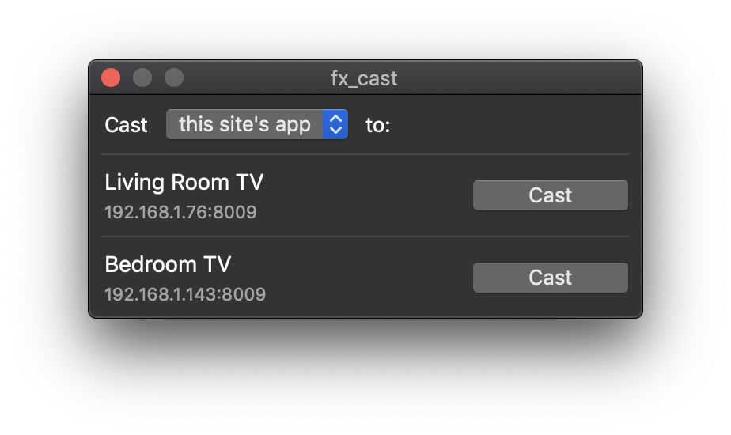

# fx_cast

Firefox extension that implements the [Chrome sender API](https://developers.google.com/cast/docs/reference/chrome/) and exposes it to web apps to enable cast support. Communication with receiver devices is handled by a native application (bridge). Check the [implementation notes](IMPLEMENTATION.md) for more info.

_**Note**: No full public release yet! Pre-release beta version is incomplete and likely buggy._


## Installing

_**Note**: Currently supported on macOS, Windows and Linux._

Install the Firefox extension (from within Firefox) and companion bridge application via the installer packages. These are two separate downloads that can be found on the [website](https://hensm.github.io/fx_cast/) or in the [GitHub releases](https://github.com/hensm/fx_cast/releases) section.

On Linux platforms, it may be necessary to [configure local hostname resolution](https://wiki.archlinux.org/index.php/avahi#Hostname_resolution).

### Install as a daemon

To install fx_cast as a daemon for systemd.
You can do the following steps:

1. Create fx_cast user: `sudo useradd --system fx_cast`
2. Create service file in /etc/systemd/fx_cast.service:
```
[Unit]

Description=FX Cast daemon

[Service]

User=fx_cast
ExecStart=/opt/fx_cast/fx_cast_bridge -d
Restart=always

[Install]
WantedBy=multi-user.target
```
3. Enable the service: `sudo systemd enable fx_cast`

### Package managers
* #### Arch Linux (AUR) - https://aur.archlinux.org/packages/fx_cast/
  ````sh
  yay -S fx_cast
  ````


## Usage

Most websites won't load the cast API unless the browser presents itself as Chrome. The extension includes a whitelist for sites that should be given a Chrome-compatible user agent string. Whitelist entries are specified as [match patterns](https://developer.mozilla.org/en-US/docs/Mozilla/Add-ons/WebExtensions/Match_patterns). To whitelist all sites, add `<all_urls>` to the whitelist, though this is not recommended and could cause breakage on random sites.

Whitelisted sites should then display a cast button as in Chrome, provided they're compatible with the extension/Firefox.

The `Cast...` menu item is visible in the page, toolbar button and tools menus, and provides access to the receiver selector at any time to stop an existing session or start screen mirroring or file casting.

HTML5 media elements also have a different `Cast...` context menu item that triggers the media sender, though this won't work for media using EME/MSE.


## Building

### Requirements
* Node.js v12.x.x
* Native build tools (see [here](https://github.com/nodejs/node-gyp#installation))
* Bonjour/Avahi (on Windows/Linux respectively)

Cross-compiling native depedencies may be possible, but isn't tested or supported. Build script options are provided for building/packaging on other platforms, but assume they won't work. Packaging on Linux for other Linux package formats should work fine.

### Installing dependencies

#### Windows:
* [Bonjour SDK for Windows](https://developer.apple.com/download/more/?=Bonjour%20SDK%20for%20Windows)
* [NSIS](https://nsis.sourceforge.io/Download)

#### Debian / Ubuntu:
````sh
sudo apt install libavahi-compat-libdnssd-dev dpkg rpm
# Runtime: avahi-daemon
````

#### Fedora:
````sh
sudo dnf install avahi-compat-libdns_sd-devel dpkg rpm-build
# Runtime: avahi nss-mdns
````

#### Arch Linux:
````sh
sudo pacman -S avahi dpkg
yay -S rpm-org
````

### Instructions

````sh
git clone https://github.com/hensm/fx_cast.git
cd fx_cast
npm install
npm run build

# Install manifest for dist/ build. Installs to
# user-specific location and overrides a system-wide
# install. Call `remove-manifest` to restore previous state.
npm run install-manifest
npm run remove-manifest
````

This will build the ext and app, outputting to `dist/`:

* #### `dist/app/`  
   ... contains the built bridge with launcher script and manifest with the path pointing that script. The `install-manifest` script copies this manifest to the proper location (or adds its current location to the registry on Windows).
* #### `dist/ext/`  
    ... contains the unpacked extension.

Watching ext changes:

````sh
npm run watch --prefix ./ext
````

Launch Firefox with built extension (run in separate terminal):

````sh
npm run start --prefix ./ext
````

#### Extension build script arguments

* `--package`  
    Should package with web-ext.
* `--watch`  
    Should run webpack in watch mode.
* `--mirroringAppId` `"<appID>"`  
    Provide an alternative default mirroring receiver app ID.
* `--mode` `"production"`, `"development"`  
    Run webpack in a different mode. Defaults to `"development"` unless combined with `--package`.

#### Bridge build script arguments

* `--usePkg`  
    Creates a single executable instead of a launcher script.
* `--package`  
    Builds and creates installer packages for distribution.
* `--arch` `"x64"`,`"x86"`  
    Select platform arch to build for. Defaults to current platform arch.
* `--skipNativeBuilds`  
    macOS only. Skips native receiver selector build.


#### 32-bit on Windows

Building a 32-bit version is only supported for Windows. If you're building from a 64-bit system, you'll also need to rebuild any native dependencies as 32-bit.

````sh
npm clean-install --prefix ./app --arch=ia32  # If on a 64-bit system

npm run build:app -- -- --arch=x86 --usePkg   # If building without packaging
npm run package:app -- -- --arch=x86          # ... else if packaging
````

### Packaging

Build and package extension and bridge application for current platform:

````sh
npm run package
````

* #### `dist/app/`  
    ... contains the installer package: `fx_cast_bridge-<version>-<arch>.(pkg|deb|rpm|exe)`
* #### `dist/ext/`  
    ... contains the built extension archive: `fx_cast-<version>.xpi`.

Packaging examples:

````sh
npm run package:ext # Packaging extension
npm run package:app # Packaging bridge application

# Linux platforms
npm run package:app -- -- --packageType=deb
npm run package:app -- -- --packageType=rpm
````

#### Bridge package script arguments

_**Note**: Includes the build script arguments._

* `--packageType` `"deb"`,`"rpm"`  
    Select the package type. Defaults to `deb`. Only relevant when building for Linux.


### Testing

Testing requires geckodriver (or chromedriver for Chrome parity testing). See [selenium-webdriver](https://www.npmjs.com/package/selenium-webdriver#installation) installation instructions (ignore `npm install`).

The test script expects a compatible installed bridge version and an extension archive at `dist/ext/`.

Test results will be displayed in the terminal and within the opened browser tab. Chrome may take some time to initialize the media router component before the cast API is available for testing.

````sh
npm run build --prefix ./app
npm run install-manifest
npm run package --prefix ./ext
npm test
SELENIUM_BROWSER=chrome npm test
````


## Video Demos

Netflix / HTML5:

[](https://www.youtube.com/watch?v=Ex9dWKYguEE)
[](https://www.youtube.com/watch?v=16r8lQKeEX8)


## Credit

_**Note**: Since it seems to be causing confusion, this project does not use electron. The electron-chromecast library was only used as a reference for the initial implementation of the API shim._

* [electron-chromecast](https://github.com/GPMDP/electron-chromecast)
* [node-castv2](https://github.com/thibauts/node-castv2)
* [icons8](https://icons8.com/)


## Donation

### PayPal

To donate via PayPal:

[](https://www.paypal.com/cgi-bin/webscr?cmd=_s-xclick&hosted_button_id=3Z2FTMSG976WN&source=url)


